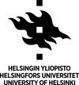

## Spectramap 1.0

Deployed at [agrispectra.farm](http://agrispectra.farm/) (faster) and [on shinyapps.io](https://agronomous.shinyapps.io/spectramap/) (slower)

Deployed at <a href="http://agrispectra.farm/" target="_blank">agrispectra.farm</a> (faster) and <a href="https://agronomous.shinyapps.io/spectramap/" target="_blank">on shinyapps.io</a> (slower)

   

**Design**:
Leonardo Cerliani^[1],
Titta Kotilainen^[2],
Matthew Robson^[3]

**Data preparation and modelling**:
Leonardo Cerliani, Titta Kotilainen, Pedro Aphalo^[3]

**R/Shiny Implementation**:
Leonardo Cerliani

### Data
AOD and Precipitable Water Data: [NASA Aeronet](https://aeronet.gsfc.nasa.gov/new_web/download_all_v3_aod.html)

Total Ozone column: [NASA Aura](https://avdc.gsfc.nasa.gov/pub/data/satellite/Aura/OMI/V03/L2OVP/OMUVB/)

Clara 2.0 satellite Surface Incoming Shortwave Radiation data, available through [CM SAF](https://wui.cmsaf.eu/safira/action/viewProduktDetails?fid=18&eid=21814)

Screen efficiency measurements carried out by Titta Kotilainen

The Open Field picture is by [Adele Payman](https://www.instagram.com/adele_payman/) on [Unsplash](https://unsplash.com/) 

### Utility
The sum of solar irradiance, expressed as the daily light integral (DLI), varies across geographical locations and with time of the year.

**Greenhouse and tunnel covering materials developed for a range of purposes modify the spectral ratios received by plants.**

**Knowledge of light conditions under these materials will allow growers to choose those that improve plant growth and yield through manipulation of the spectral quality of sunlight.**

To make information on DLI and light quality readily accessible to growers we have designed an easy-to-use app. The app provides information on: (1) Solar DLI as a global map for a selected month and a monthly time series of DLI; (2) The effect on photon ratios of sunlight transmitted by +80 commercially available screens 

DLI is calculated from the [Clara 2.0 satellite surface incoming shortwave radiation data (200-4000 nm), available through EUMETSAT CM SAF](https://wui.cmsaf.eu/safira/action/viewProduktDetails?fid=18&eid=21814) Climate Monitoring. The user obtains monthly DLIs at a desired location averaged over the period of 2005-2015.

The effect of the covering material is calculated at <1 nm resolution and displayed as biologically meaningful spectral photon ratios of Red to Far-Red (R:FR), Blue to Green (B:G) and Blue to ed (B:R). For this, monthly data is estimated using a linear model based on the historical data (last 10-20 years) of total ozone column depth ([NASA Aura](https://avdc.gsfc.nasa.gov/pub/data/satellite/Aura/OMI/V03/L2OVP/OMUVB/)), precipitable water vapour and aerosol optical density ([NASA Aeronet AOD 2.0](https://aeronet.gsfc.nasa.gov/new_web/download_all_v3_aod.html)).

Using dropdown-menus for "Manufacturer" and "Filter Type", the user can select the best material for their desired purpose (e.g. climate screen or shade net). The app provides calculated spectral ratios of sunlight transmitted under the selected materials, and plots this information for easy visual comparison, together with an image of each material.

### References
Spectal photon ratios are calculated as follows: blue:green (B:G) 420–490 nm/500-570 nm, blue:red (B:R) 420–490 nm/620-680 nm, red:far-red (R:FR) 655–665 nm/725–735 nm. B:G and B:R are according to Sellaro et al. (2010) and R:FR according to Smith (1982).

Sellaro R., Crepy M., Trupkin S.A., Karayekov E., Buchovsky A.S., Rossi,C., Casal J.J. (2010) Cryptochrome as a sensor of the blue/green ratio of natural radiation in Arabidopsis. Plant Physiol. 154, 401–9. https://doi.org/10.1104/pp.110.160820

Smith H. (1982) Light quality, photoperception and plant strategy. Annu. Rev. Plant Physiol. 33, 481–518.

DLI is calculated from the surface incoming shortwave radiation data according to Faust & Logan (2018).

Faust J.E. & Logan J. (2018) Daily light integral: A research review and high-resolution maps of the Unites States. HortScience 53, 1250-1257.

For detailed description about the materials and the complete data set of those measurements: https://zenodo.org/record/1472634#.XfE3MZMzapq

**Affiliations**

1: [Leonardo Cerliani](leonardo.cerliani@gmail.com), Netherlands Institute for Neuroscience, Amsterdam, the Netherlands

2: [Titta Kotilainen](titta.kotilainen@luke.fi), [Natural Resources Institute Finland - LUKE](https://www.luke.fi/), Turku, Finland

3: [Matthew Robson](matthew.robson@helsinki.fi), [Pedro Aphalo](pedro.aphalo@helsinki.fi), Organismal and Evolutionary Biology (OEB), Viikki Plant Science Centre (ViPS), [Faculty of Biological and Environmental Sciences](https://researchportal.helsinki.fi/en/persons/t-matthew-robson), University of Helsinki, Finland

Made with [R/Shiny](https://shiny.rstudio.com/) 
Copyright 2019, Leonardo Cerliani, Titta Kotilainen, Matthew Robson
